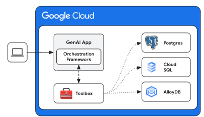

# 🧰 Toolbox

> [!CAUTION]
> Toolbox is experimental and not an official Google product. This is 
> an early access project, intended to be shared under NDA to gather feedback
> validate direction. You should not share or discuss this project with anyone 
> not under NDA. 

Toolbox is an open source server that enables developers to build
production-grade, agent-based generative AI applications that connect to
databases via tools. It enables you to create database-focused tools
easier, faster, and more securely by handling the complexities around
connection pooling, authentication, and more. 

Toolbox also helps simplifies the management of your tools by allowing you to
add, remove, or update tools without necessarily redeploying your application.
It sits between your application's orchestration framework (such as LangChain
and LlamaIndex) and your database, providing a control plane that is used to
modify, distribute, and invoke tools.



<!-- TOC ignore:true -->
## Table of Contents

<!-- TOC -->

- [Getting Started](#getting-started)
    - [Installing the server](#installing-the-server)
    - [Running the server](#running-the-server)
    - [Using with Client SDKs](#using-with-client-sdks)
- [Configuration](#configuration)
    - [Sources](#sources)
    - [Tools](#tools)
    - [Toolsets](#toolsets)
- [Versioning](#versioning)
- [Contributing](#contributing)

<!-- /TOC -->

## Getting Started

### Installing the server
<!-- {x-release-please-start-version} -->
For the latest version, check the [releases page][releases] and use the
following instructions for your OS and CPU architecture.

<details open>
<summary>Binary</summary>


[releases]: https://github.com/googleapis/genai-toolbox/releases

```sh
# see releases page for other versions
curl -O https://storage.googleapis.com/genai-toolbox/v0.0.1/linux/amd64/toolbox
chmod +x toolbox
```

</details>

<details>
<summary>Container Images</summary>
You can also install Toolbox as a container: 

```sh
# see releases page for other versions
docker pull us-central1-docker.pkg.dev/database-toolbox/toolbox/toolbox:$VERSION
```
</details>

<details>
<summary>Compile from source</summary>

To install from source, ensure you have the latest version of 
[Go installed](https://go.dev/doc/install).

```sh
go install github.com/googleapis/genai-toolbox@v0.0.1
```
</details>
<!-- {x-release-please-end} -->

### Running the server
[Configure](#configuration) a `tools.yaml` to define your tools, and then 
execute `toolbox` to start the server:

```sh
./toolbox --tools_file "tools.yaml"
```

You can use `toolbox help` for a full list of flags! To stop the server, send a
terminate signal (`ctrl+c` on most platforms).

For more detailed documentation on deploying to different environments, check
out the following in the `/docs/deploy` folder:
  * [Cloud Run](./docs/deploy/deploy_toolbox.md).

### Using with Client SDKs

Once your server is up and running, you can load the tools into your
application. See below the list of Client SDKs for using various frameworks:

<details open>
<summary>LangChain / LangGraph</summary>

Once you've installed the [Toolbox LangChain SDK][langchain-sdk], you can load 
tools: 

```python
from toolbox_langchain_sdk import ToolboxClient

# update the url to point to your server
client = ToolboxClient("http://127.0.0.1:5000")

# these tools can be passed to your application! 
tools = await client.load_toolset()
```

For more detailed instructions on using the Toolbox LangChain SDK, see the
[project's README][langchain-sdk-readme].

[langchain-sdk]: ./sdks/langchain/
[langchain-sdk-readme]: ./sdks/langchain/README.md

</details>

<details open>
<summary>LlamaIndex</summary>

Once you've installed the [Toolbox LlamaIndex SDK][llamaindex-sdk], you can load 
tools: 

```python
from toolbox_llamaindex_sdk import ToolboxClient

# update the url to point to your server
client = ToolboxClient("http://127.0.0.1:5000")

# these tools can be passed to your application! 
tools = await client.load_toolset()
```

For more detailed instructions on using the Toolbox LlamaIndex SDK, see the
[project's README][llamaindex-sdk-readme].

[llamaindex-sdk]: ./sdks/llamaindex/
[llamaindex-sdk-readme]: ./sdks/llamaindex/README.md

</details>

## Configuration

You can configure what tools are available by updating the `tools.yaml` file. If
you have multiple files, you can tell toolbox which to load with the
`--tools_file tools.yaml` flag. 

### Sources

The `sources` section of your `tools.yaml` defines what data sources your
Toolbox should have access to. Most tools will have at least one source to
execute against.

```yaml
sources:
    # This tool kind has some requirements. 
    # See https://github.com/googleapis/genai-toolbox/blob/main/docs/sources/cloud-sql-pg.md#requirements
    my-cloud-sql-source:
        kind: cloud-sql-postgres
        project: my-project-name
        region: us-central1
        instance: my-instance-name
        user: my-user
        password: my-password
        database: my_db
```

For more details on configuring different types of sources, see the [Source
documentation.](docs/sources/README.md)


### Tools

The `tools` section of your `tools.yaml` define your tools: what kind of tool it
is, which source it affects, what parameters it takes, etc. 

```yaml
tools:
    get_flight_by_id:
        kind: postgres-sql
        source: my-cloud-sql-source
        description: >
            Use this tool to lookup a flight by its unique identifier.
        statement: "SELECT * FROM flights WHERE id = $1"
        parameters:
        - name: id
          type: integer
          description: 'id' represents the unique ID for each flight. 
```

For more details on configuring different types of tools, see the [Tool
documentation.](docs/tools/README.md)


### Toolsets

The `toolsets` section of your `tools.yaml` allows you to define groups of tools
that you want to be able to load together. This can be useful for defining
different groups based on agent or application. 

```yaml
toolsets:
    my_first_toolset:
        - my_first_tool
        - my_second_tool
    my_second_toolset:
        - my_second_tool
        - my_third_tool
```

You can load toolsets by name:
```python
# This will load all tools
all_tools = await client.load_toolset()

# This will only load the tools listed in 'my_second_toolset'
my_second_toolset = await client.load_toolset("my_second_toolset")
```


## Versioning

This project uses [semantic versioning](https://semver.org/), and uses the
following lifecycle regarding support for a major version.

## Contributing

Contributions are welcome. Please, see the [CONTRIBUTING](CONTRIBUTING.md) 
to get started. 

Please note that this project is released with a Contributor Code of Conduct.
By participating in this project you agree to abide by its terms. See
[Contributor Code of Conduct](CODE_OF_CONDUCT.md) for more information.

