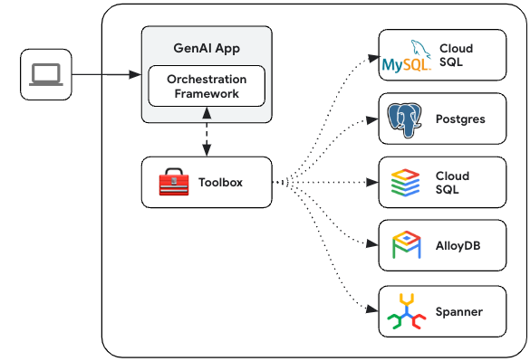

MCP Toolbox for Databases is an open source MCP server for databases. It enables
you to develop tools easier, faster, and more securely by handling the complexities
such as connection pooling, authentication, and more.


This solution was originally named “Gen AI Toolbox for
Databases” as its initial development predated MCP, but was renamed to align
with recently added MCP compatibility.


## Why Toolbox?

Toolbox helps you build Gen AI tools that let your agents access data in your
database. Toolbox provides:

- **Simplified development**: Integrate tools to your agent in less than 10
  lines of code, reuse tools between multiple agents or frameworks, and deploy
  new versions of tools more easily.
- **Better performance**: Best practices such as connection pooling,
  authentication, and more.
- **Enhanced security**: Integrated auth for more secure access to your data
- **End-to-end observability**: Out of the box metrics and tracing with built-in
  support for OpenTelemetry.

**⚡ Supercharge Your Workflow with an AI Database Assistant ⚡**

Stop context-switching and let your AI assistant become a true co-developer. By
[connecting your IDE to your databases with MCP Toolbox][connect-ide], you can
delegate complex and time-consuming database tasks, allowing you to build faster
and focus on what matters. This isn't just about code completion; it's about
giving your AI the context it needs to handle the entire development lifecycle.

Here’s how it will save you time:

- **Query in Plain English**: Interact with your data using natural language
  right from your IDE. Ask complex questions like, *"How many orders were
  delivered in 2024, and what items were in them?"* without writing any SQL.
- **Automate Database Management**: Simply describe your data needs, and let the
  AI assistant manage your database for you. It can handle generating queries,
  creating tables, adding indexes, and more.
- **Generate Context-Aware Code**: Empower your AI assistant to generate
  application code and tests with a deep understanding of your real-time
  database schema.  This accelerates the development cycle by ensuring the
  generated code is directly usable.
- **Slash Development Overhead**: Radically reduce the time spent on manual
  setup and boilerplate. MCP Toolbox helps streamline lengthy database
  configurations, repetitive code, and error-prone schema migrations.

Learn [how to connect your AI tools (IDEs) to Toolbox using MCP][connect-ide].

[connect-ide]: ../../how-to/connect-ide/

## General Architecture

Toolbox sits between your application's orchestration framework and your
database, providing a control plane that is used to modify, distribute, or
invoke tools. It simplifies the management of your tools by providing you with a
centralized location to store and update tools, allowing you to share tools
between agents and applications and update those tools without necessarily
redeploying your application.



## Getting Started

### Installing the server

For the latest version, check the [releases page][releases] and use the
following instructions for your OS and CPU architecture.

[releases]: https://github.com/googleapis/genai-toolbox/releases

<!-- {x-release-please-start-version} -->

{}

To install Toolbox as a binary:

```sh
# see releases page for other versions
export VERSION=0.9.0
curl -O https://storage.googleapis.com/genai-toolbox/v$VERSION/linux/amd64/toolbox
chmod +x toolbox
```

{}
{}
You can also install Toolbox as a container:

```sh
# see releases page for other versions
export VERSION=0.9.0
docker pull us-central1-docker.pkg.dev/database-toolbox/toolbox/toolbox:$VERSION
```

{}
{}

To install from source, ensure you have the latest version of
[Go installed](https://go.dev/doc/install), and then run the following command:

```sh
go install github.com/googleapis/genai-toolbox@v0.9.0
```

{}

<!-- {x-release-please-end} -->

### Running the server

[Configure](../configure.md) a `tools.yaml` to define your tools, and then
execute `toolbox` to start the server:

```sh
./toolbox --tools-file "tools.yaml"
```

Toolbox enables dynamic reloading by default. To disable, use the `--disable-reload` flag.


You can use `toolbox help` for a full list of flags! To stop the server, send a
terminate signal (`ctrl+c` on most platforms).

For more detailed documentation on deploying to different environments, check
out the resources in the [How-to section](../../how-to/_index.md)

### Integrating your application

Once your server is up and running, you can load the tools into your
application. See below the list of Client SDKs for using various frameworks:

#### Python

{}

Once you've installed the [Toolbox Core
SDK](https://pypi.org/project/toolbox-core/), you can load
tools:


from toolbox_core import ToolboxClient

# update the url to point to your server

async with ToolboxClient("<http://127.0.0.1:5000>") as client:

    # these tools can be passed to your application!
    tools = await client.load_toolset("toolset_name")


For more detailed instructions on using the Toolbox Core SDK, see the
[project's README](https://github.com/googleapis/mcp-toolbox-sdk-python/blob/main/packages/toolbox-core/README.md).

{}
{}

Once you've installed the [Toolbox LangChain
SDK](https://pypi.org/project/toolbox-langchain/), you can load
tools:


from toolbox_langchain import ToolboxClient

# update the url to point to your server

async with ToolboxClient("<http://127.0.0.1:5000>") as client:

    # these tools can be passed to your application!
    tools = client.load_toolset()


For more detailed instructions on using the Toolbox LangChain SDK, see the
[project's README](https://github.com/googleapis/mcp-toolbox-sdk-python/blob/main/packages/toolbox-langchain/README.md).

{}
{}

Once you've installed the [Toolbox Llamaindex
SDK](https://github.com/googleapis/genai-toolbox-llamaindex-python), you can load
tools:


from toolbox_llamaindex import ToolboxClient

# update the url to point to your server

async with ToolboxClient("<http://127.0.0.1:5000>") as client:

# these tools can be passed to your application

  tools = client.load_toolset()


For more detailed instructions on using the Toolbox Llamaindex SDK, see the
[project's README](https://github.com/googleapis/genai-toolbox-llamaindex-python/blob/main/README.md).

{}


#### Javascript/Typescript

Once you've installed the [Toolbox Core
SDK](https://www.npmjs.com/package/@toolbox-sdk/core), you can load
tools:


{}


import { ToolboxClient } from '@toolbox-sdk/core';

// update the url to point to your server
const URL = 'http://127.0.0.1:5000';
let client = new ToolboxClient(URL);

// these tools can be passed to your application!
const toolboxTools = await client.loadToolset('toolsetName');


{}
{}


import { ToolboxClient } from '@toolbox-sdk/core';

// update the url to point to your server
const URL = 'http://127.0.0.1:5000';
let client = new ToolboxClient(URL);

// these tools can be passed to your application!
const toolboxTools = await client.loadToolset('toolsetName');

// Define the basics of the tool: name, description, schema and core logic
const getTool = (toolboxTool) => tool(currTool, {
    name: toolboxTool.getName(),
    description: toolboxTool.getDescription(),
    schema: toolboxTool.getParamSchema()
});

// Use these tools in your Langchain/Langraph applications
const tools = toolboxTools.map(getTool);


{}
{}


import { ToolboxClient } from '@toolbox-sdk/core';
import { genkit } from 'genkit';

// Initialise genkit
const ai = genkit({
    plugins: [
        googleAI({
            apiKey: process.env.GEMINI_API_KEY || process.env.GOOGLE_API_KEY
        })
    ],
    model: googleAI.model('gemini-2.0-flash'),
});

// update the url to point to your server
const URL = 'http://127.0.0.1:5000';
let client = new ToolboxClient(URL);

// these tools can be passed to your application!
const toolboxTools = await client.loadToolset('toolsetName');

// Define the basics of the tool: name, description, schema and core logic
const getTool = (toolboxTool) => ai.defineTool({
    name: toolboxTool.getName(),
    description: toolboxTool.getDescription(),
    schema: toolboxTool.getParamSchema()
}, toolboxTool)

// Use these tools in your Genkit applications
const tools = toolboxTools.map(getTool);


{}
{}


import { ToolboxClient } from '@toolbox-sdk/core';
import { tool } from "llamaindex";

// update the url to point to your server
const URL = 'http://127.0.0.1:5000';
let client = new ToolboxClient(URL);

// these tools can be passed to your application!
const toolboxTools = await client.loadToolset('toolsetName');

// Define the basics of the tool: name, description, schema and core logic
const getTool = (toolboxTool) => tool({
    name: toolboxTool.getName(),
    description: toolboxTool.getDescription(),
    parameters: toolboxTool.getParams(),
    execute: toolboxTool
});;

// Use these tools in your LlamaIndex applications
const tools = toolboxTools.map(getTool);



{}


For more detailed instructions on using the Toolbox Core SDK, see the
[project's README](https://github.com/googleapis/mcp-toolbox-sdk-js/blob/main/packages/toolbox-core/README.md).